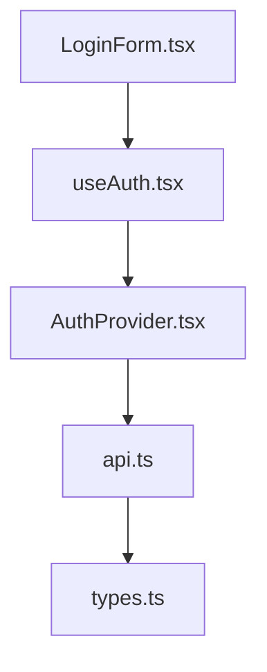

# Analysis Type Decision Trees

**Purpose**: Guides for different analysis scenarios using intelligence-first approach.

---

## Tree 1: Bug Diagnosis

**Use When**: User reports error/bug or unexpected behavior

**Process**:
```
User reports error/bug
    ↓
1. Search for error message/symptom keywords (project-intel.mjs --search)
    ↓
2. Locate function/component with issue (--symbols)
    ↓
3. Trace dependencies upstream (what does it use?)
    ↓
4. Find discrepancy (missing check, wrong data)
    ↓
5. Verify with MCP if library-related
    ↓
6. Report with root cause at file:line
```

**Key Intelligence Queries**:
- `project-intel.mjs --search "<error-message>" --json`
- `project-intel.mjs --search "<component-name>" --type tsx --json`
- `project-intel.mjs --symbols path/to/suspected-file.tsx --json`
- `project-intel.mjs --dependencies path/to/suspected-file.tsx --direction upstream --json`

**Output Focus**:
- Specific file:line reference for bug location
- Evidence chain from symptom to root cause
- MCP verification if library behavior involved
- Actionable fix recommendation

**Example Objective**:
"Why does LoginForm component re-render infinitely?"

**Example Root Cause**:
```
Root Cause: src/components/LoginForm.tsx:47
Issue: useEffect depends on [user] but mutates user object
Fix: Use functional setState or remove user from dependencies
Evidence: project-intel.mjs symbols query + MCP Ref verification
```

---

## Tree 2: Architecture Analysis

**Use When**: User wants to understand system design, component relationships, or code organization

**Process**:
```
User wants to understand system design
    ↓
1. Get project overview (project-intel.mjs --overview)
    ↓
2. Identify entry points (main.tsx, index.ts, app.tsx)
    ↓
3. Trace dependencies from entry points (--dependencies --downstream)
    ↓
4. Build dependency graph
    ↓
5. Analyze patterns:
   - Circular dependencies?
   - Deep nesting?
   - Tight coupling?
    ↓
6. Report with visualization (mermaid diagram)
```

**Key Intelligence Queries**:
- `project-intel.mjs --overview --json`
- `project-intel.mjs --dependencies path/to/entry-point.tsx --direction downstream --json`
- `project-intel.mjs --trace path/to/component.tsx --json`

**Output Focus**:
- Dependency graph visualization (mermaid)
- Component relationships
- Coupling analysis
- Module boundaries
- Potential architectural issues (circular deps, tight coupling)

**Example Objective**:
"What is the architecture of the authentication module?"

**Example Output**:
```markdown
## Architecture Summary

Entry Point: src/auth/index.ts
Components: 5 files (LoginForm, AuthProvider, useAuth, api, types)

Dependency Graph:


Analysis:
- Clean layered architecture (UI → hooks → provider → API)
- No circular dependencies
- Proper type separation
```

---

## Tree 3: Performance Analysis

**Use When**: User reports slow operation, high memory usage, or wants optimization

**Process**:
```
User reports slow operation
    ↓
1. Search for suspected slow operations (queries, loops, renders)
    ↓
2. Trace data flow from source to sink
    ↓
3. Identify bottlenecks:
   - N+1 queries?
   - Unnecessary re-renders?
   - Large data processing?
   - Inefficient algorithms?
    ↓
4. Measure impact (how many times called? on what trigger?)
    ↓
5. Verify best practices with MCP (React performance, DB optimization)
    ↓
6. Report with optimization recommendations
```

**Key Intelligence Queries**:
- `project-intel.mjs --search "query|fetch|map|filter" --json`
- `project-intel.mjs --callers suspectedSlowFunction --json`
- `project-intel.mjs --callees suspectedSlowFunction --json`
- `project-intel.mjs --symbols path/to/slow-component.tsx --json`

**Output Focus**:
- Bottleneck identification with file:line
- Call frequency analysis (how often executed)
- Data volume analysis (size of datasets processed)
- Optimization strategy with specific recommendations
- Before/after performance estimates

**Example Objective**:
"Why is the user list page loading slowly?"

**Example Root Cause**:
```
Bottleneck: src/pages/UserList.tsx:67
Issue: Fetching user details individually in loop (N+1 query pattern)
Impact: 100 users = 100 separate API calls (5s total)
Fix: Batch fetch with single API call (0.3s total)
Evidence:
- project-intel.mjs --symbols → fetchUserDetails at line 67
- project-intel.mjs --callers fetchUserDetails → called in map()
- MCP Ref verification: React docs recommend batching data fetches
```

---

## Decision Tree Selection Guide

**Choose Tree 1 (Bug Diagnosis)** when:
- Error message or stack trace present
- User reports "not working" or "broken"
- Unexpected behavior described
- Test failures

**Choose Tree 2 (Architecture Analysis)** when:
- User asks "how does X work?"
- Understanding system structure
- Planning major refactoring
- Evaluating code organization

**Choose Tree 3 (Performance Analysis)** when:
- User reports "slow" or "laggy"
- High resource usage
- Optimization needed
- Scaling concerns

**Can Combine Multiple Trees**:
- Bug diagnosis may reveal architectural issues
- Performance analysis may uncover bugs
- Architecture review may identify performance bottlenecks

---

## Common Patterns Across All Trees

**Always Start With**:
1. Project overview (if first analysis in session)
2. Targeted search for relevant code
3. Symbol analysis before reading files
4. Dependency tracing to understand relationships

**Always End With**:
1. CoD^Σ trace showing reasoning chain
2. Specific file:line references
3. Evidence from intelligence queries
4. MCP verification (if applicable)
5. Actionable recommendations

**Token Budget**:
- Tree 1 (Bug): ~1000-2000 tokens
- Tree 2 (Architecture): ~2000-3000 tokens
- Tree 3 (Performance): ~1500-2500 tokens

Compare to 10,000-20,000 tokens for reading full files.
