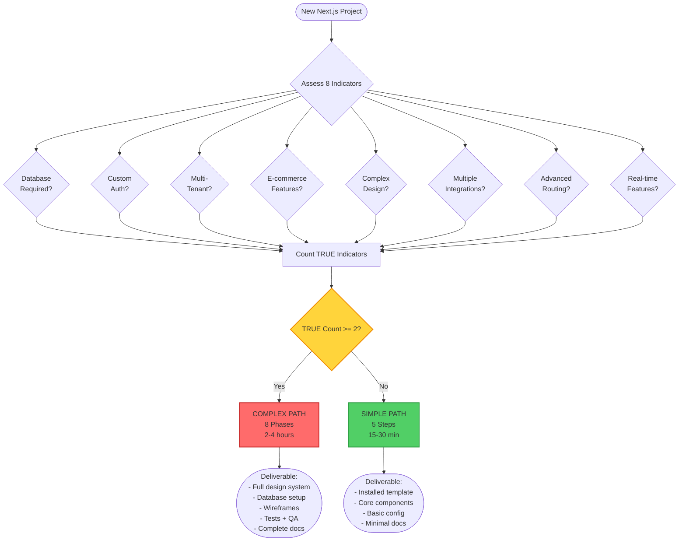

# Complexity Assessment Decision Tree

**Purpose**: Provide explicit criteria for choosing between Simple and Complex Next.js project setup paths

**Target Audience**: AI agents making autonomous setup decisions

**Decision Point**: Should this project use Simple Path (15-30 min) or Complex Path (2-4 hours)?

---

## Decision Tree (ASCII)

```
                        New Next.js Project
                               |
                    Assess Complexity Indicators
                               |
                    /--------------------------\
                   /                            \
            Count TRUE                    Count FALSE
            indicators                     indicators
                   \                            /
                    \--------------------------/
                               |
                        IF Count >= 2
                               |
                    /-----------+-----------\
                   /                         \
              TRUE >= 2                  FALSE >= 2
           (Complex Path)               (Simple Path)
                   |                          |
            8-Phase Setup              5-Step Quick Setup
         (2-4 hours, full              (15-30 min, template
          orchestration)                    + basics)
                   |                          |
              Deliverable:                Deliverable:
         - Full design system          - Installed template
         - Database setup              - Core components
         - Wireframes                  - Basic config
         - Tests + QA                  - Minimal docs
         - Complete docs
```

---

## Complexity Indicators (Explicit Criteria)

### Complex Indicators (Check for TRUE)

**1. Database Required**
```
Question: Does the project need persistent data storage?

✓ TRUE if ANY:
  - User mentions: "database", "DB", "data storage", "persist data"
  - Features require: user accounts, profiles, transactions, orders
  - Multi-tenant architecture mentioned
  - Supabase, PostgreSQL, MongoDB mentioned

✗ FALSE if:
  - Static content only (blog posts from markdown)
  - No user accounts or dynamic data
  - Content managed externally (headless CMS)

Example TRUE: "E-commerce site with product catalog"
Example FALSE: "Marketing site with company info"
```

**2. Custom Authentication Required**
```
Question: Does the project need custom auth patterns beyond template defaults?

✓ TRUE if ANY:
  - OAuth providers beyond template defaults
  - Custom auth flows (passwordless, magic link, MFA)
  - Role-based access control (RBAC)
  - Permission systems mentioned
  - SSO integration required

✗ FALSE if:
  - No authentication needed
  - Template's default auth sufficient
  - Public-facing only

Example TRUE: "Admin dashboard with role-based permissions"
Example FALSE: "Public blog, no login"
```

**3. Multi-Tenant Architecture**
```
Question: Does the project serve multiple isolated customer organizations?

✓ TRUE if ANY:
  - "Multi-tenant", "multiple organizations", "workspace isolation"
  - Each customer has separate data/branding
  - SaaS product mentioned
  - Tenant-specific URLs (org.example.com)

✗ FALSE if:
  - Single organization/owner
  - Multiple users but shared data space
  - No isolation requirements

Example TRUE: "SaaS platform where each company has isolated workspace"
Example FALSE: "Social network where all users see same content"
```

**4. E-commerce Features**
```
Question: Does the project need shopping cart, payments, inventory?

✓ TRUE if ANY:
  - "E-commerce", "shop", "store", "buy", "sell"
  - Product catalog with pricing
  - Shopping cart functionality
  - Payment processing (Stripe, PayPal)
  - Inventory management
  - Order tracking

✗ FALSE if:
  - No transactions
  - External links to purchase (affiliate)
  - Contact-only, no direct purchase

Example TRUE: "Online store selling physical products"
Example FALSE: "Portfolio showcasing design work"
```

**5. Complex/Custom Design System**
```
Question: Does the project need elaborate, highly customized design?

✓ TRUE if ANY:
  - User provides detailed design specifications
  - Custom brand identity beyond template capabilities
  - Complex animations or interactions
  - Unique layout patterns not in templates
  - Multiple design themes/variants
  - User mentions specific design system (Material, Fluent, custom)

✗ FALSE if:
  - Standard template design acceptable
  - Minimal customization needed
  - User says "simple", "clean", "standard"

Example TRUE: "Creative agency site with unique animations and brand identity"
Example FALSE: "Standard blog layout with custom colors"
```

**6. Multiple External Integrations**
```
Question: Does the project need multiple third-party service integrations?

✓ TRUE if ANY:
  - ≥3 external APIs (CRM, analytics, email, payment, etc.)
  - Webhooks from external services
  - Real-time data sync with external systems
  - Complex API orchestration

✗ FALSE if:
  - Analytics only (Google Analytics, Plausible)
  - Email notifications via basic service
  - ≤2 simple integrations

Example TRUE: "Dashboard integrating Salesforce + Stripe + SendGrid + Twilio"
Example FALSE: "Blog with Google Analytics"
```

**7. Advanced Routing Patterns**
```
Question: Does the project need parallel routes, intercepting routes, or complex routing?

✓ TRUE if ANY:
  - Modal routes mentioned
  - Parallel data loading requirements
  - Dynamic nested routing ≥3 levels
  - Route groups with different layouts
  - Intercepting routes for modals/drawers

✗ FALSE if:
  - Simple page hierarchy
  - Standard nested routing ≤2 levels
  - Blog-style structure (posts/[slug])

Example TRUE: "E-commerce with category/product/review modals + parallel cart"
Example FALSE: "Blog with post pages and about page"
```

**8. Real-time Features**
```
Question: Does the project need WebSockets, SSE, or real-time updates?

✓ TRUE if ANY:
  - "Real-time", "live updates", "WebSocket", "SSE"
  - Chat functionality
  - Collaborative editing
  - Live dashboards with streaming data
  - Presence indicators (who's online)

✗ FALSE if:
  - Polling acceptable (refresh every X seconds)
  - No time-critical updates
  - Static or near-static content

Example TRUE: "Collaborative document editor with live cursors"
Example FALSE: "News site with hourly updates"
```

---

## Decision Algorithm (Pseudo-Code)

```python
def assess_complexity(project_requirements):
    indicators = {
        "database_required": check_database(requirements),
        "custom_auth": check_auth(requirements),
        "multi_tenant": check_tenancy(requirements),
        "e_commerce": check_commerce(requirements),
        "complex_design": check_design(requirements),
        "multiple_integrations": check_integrations(requirements),
        "advanced_routing": check_routing(requirements),
        "real_time": check_realtime(requirements)
    }

    true_count = sum(indicators.values())

    if true_count >= 2:
        return "COMPLEX", indicators, "Use 8-phase orchestration (2-4 hours)"
    else:
        return "SIMPLE", indicators, "Use 5-step quick setup (15-30 min)"
```

---

## Example Assessments

### Example 1: Personal Blog

**Requirements**: "I want a personal blog to share my writing. Markdown posts, RSS feed, simple design."

**Assessment**:
- ❌ Database: No (markdown files)
- ❌ Custom Auth: No (public)
- ❌ Multi-Tenant: No (single author)
- ❌ E-commerce: No
- ❌ Complex Design: No ("simple design")
- ❌ Multiple Integrations: No (basic analytics at most)
- ❌ Advanced Routing: No (simple blog structure)
- ❌ Real-time: No

**TRUE Count**: 0 / 8
**Decision**: ✅ SIMPLE PATH (15-30 min)
**Rationale**: No complex indicators present

---

### Example 2: SaaS Dashboard

**Requirements**: "Multi-tenant SaaS dashboard with user management, Stripe billing, and analytics."

**Assessment**:
- ✅ Database: YES (user data, tenants)
- ✅ Custom Auth: YES (user management, roles)
- ✅ Multi-Tenant: YES ("multi-tenant" explicitly mentioned)
- ✅ E-commerce: YES (Stripe billing)
- ❌ Complex Design: MAYBE (assume standard dashboard)
- ✅ Multiple Integrations: YES (Stripe + analytics = 2+)
- ❌ Advanced Routing: MAYBE (dashboard likely standard)
- ❌ Real-time: Not mentioned

**TRUE Count**: 5 / 8
**Decision**: ✅ COMPLEX PATH (2-4 hours)
**Rationale**: Multi-tenant + billing + auth = complex orchestration needed

---

### Example 3: Marketing Site

**Requirements**: "Company marketing site with services page, contact form, and team bios."

**Assessment**:
- ❌ Database: No (static content)
- ❌ Custom Auth: No (public)
- ❌ Multi-Tenant: No
- ❌ E-commerce: No
- ❌ Complex Design: No (standard corporate)
- ❌ Multiple Integrations: No (basic contact form)
- ❌ Advanced Routing: No (simple pages)
- ❌ Real-time: No

**TRUE Count**: 0 / 8
**Decision**: ✅ SIMPLE PATH (15-30 min)
**Rationale**: Standard marketing site, no complex features

---

### Example 4: E-commerce Store

**Requirements**: "Online store selling clothing. Product catalog, shopping cart, Stripe checkout, inventory tracking."

**Assessment**:
- ✅ Database: YES (products, orders, inventory)
- ❌ Custom Auth: MAYBE (customer accounts optional)
- ❌ Multi-Tenant: No (single merchant)
- ✅ E-commerce: YES (explicit e-commerce)
- ❌ Complex Design: MAYBE (standard e-commerce template might work)
- ✅ Multiple Integrations: YES (Stripe + inventory system)
- ❌ Advanced Routing: No (standard product/category)
- ❌ Real-time: No (polling acceptable for inventory)

**TRUE Count**: 3 / 8
**Decision**: ✅ COMPLEX PATH (2-4 hours)
**Rationale**: E-commerce + database + multiple integrations = complex

---

## Mermaid Diagram (Visual Representation)



---

## User Override Protocol

**If User Disagrees with Assessment**:

```markdown
AI Assessment: SIMPLE PATH (0/8 indicators)
Your project: "Basic blog"

[OVERRIDE] Do you want to use COMPLEX PATH instead?

Reasons to override:
- You anticipate future complexity
- You want comprehensive documentation from start
- You prefer full design system exploration
- Learning/educational purposes

User Response Options:
1. "Yes, use complex" → Proceed with 8-phase setup
2. "No, simple is fine" → Proceed with 5-step setup
3. "Unsure" → Ask clarifying questions about future plans
```

**Always Ask for Confirmation**:
```
Assessment complete:
- Indicators: 3/8 TRUE (Database, E-commerce, Integrations)
- Recommendation: COMPLEX PATH (2-4 hours)
- Reason: E-commerce + database requires full orchestration

Confirm: Proceed with complex path? (Y/n)
```

---

## Edge Cases & Ambiguities

### Edge Case 1: "I'm not sure if I need database"

**Resolution**:
```
Ask clarifying questions:
- Will users create accounts?
- Will data persist between sessions?
- Will users submit forms that need storage?

If ANY answer is "Yes" or "Maybe":
  → Mark Database: TRUE
  → Lean toward COMPLEX PATH

If all answers are "No":
  → Mark Database: FALSE
  → Continue assessment
```

### Edge Case 2: Borderline Case (1/8 indicators)

**Resolution**:
```
IF true_count == 1:
  Identify the TRUE indicator
  Ask: "Is this indicator critical or optional?"

  IF critical (e.g., "Database is core to the concept"):
    → Consider COMPLEX PATH
    → Explain tradeoff: "Simple path possible but may need refactor later"

  IF optional (e.g., "Maybe add auth later"):
    → Recommend SIMPLE PATH
    → Note: "Can add complexity incrementally"
```

### Edge Case 3: User provides incomplete information

**Resolution**:
```
Use clarification protocol:

[CLARIFY: What features will the project have?]

Context: Need to assess complexity for appropriate setup path
Prompt:
  - Will users create accounts? (Y/N)
  - Will data be stored in a database? (Y/N)
  - Any special integrations needed? (List if yes)
  - Standard or custom design? (Standard/Custom)

Based on responses → Complete assessment
```

---

## Anti-Patterns (Do NOT Do)

❌ **Guessing when information is incomplete**
- Always ask clarifying questions
- Better to spend 2 minutes asking than choose wrong path

❌ **Assuming "later" features don't count**
- If user mentions future plans, include in assessment
- Example: "Start simple, add auth later" → Auth indicator = TRUE

❌ **Ignoring user's explicit complexity statement**
- If user says "This is complex", believe them
- Override assessment if user has strong preference

❌ **Choosing complex path "just to be safe"**
- Overengineering wastes time and confuses users
- Simple path can scale up incrementally

✅ **Correct Pattern**:
- Assess objectively using 8 indicators
- Ask clarifying questions if ambiguous
- Confirm decision with user
- Document rationale for audit trail

---

## Integration with SKILL.md

**Where Used**: .claude/skills/nextjs-project-setup/SKILL.md:100-139

**Reference Pattern**:
```
User: "I want to build [description]"

AI:
  1. Extract requirements from description
  2. Reference @docs/decision-trees/complexity-assessment.md
  3. Count TRUE indicators
  4. Present assessment and recommendation
  5. Confirm with user
  6. Proceed with appropriate path (Simple or Complex)
```

---

## Continuous Improvement

**Feedback Loop**:
- After each project setup, note if path choice was correct
- If user had to switch paths mid-setup → analyze why
- Update indicators or thresholds based on patterns
- Add new edge cases discovered

**Metrics to Track**:
- % of Simple path completions without issues
- % of Complex path completions where all phases used
- Path switches (Simple → Complex or Complex → Simple)
- User satisfaction with path choice

---

**Document Status**: Active
**Last Updated**: 2025-10-30
**Version**: 1.0
**Maintained by**: Claude Code Intelligence Toolkit Team
